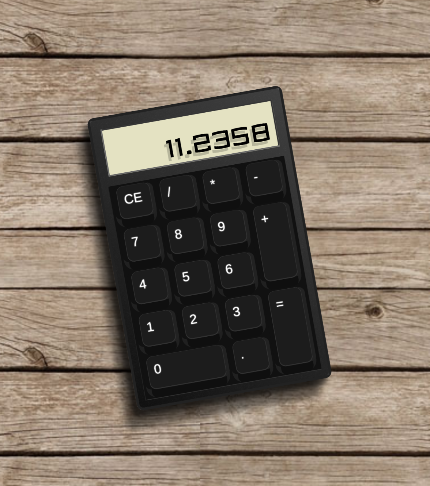

# Build a JavaScript Calculator - FreeCodeCamp

Objective: Build a CodePen.io app that is functionally similar to this: https://codepen.io/FreeCodeCamp/full/rLJZrA/.

Fulfill the below user stories. Use whichever libraries or APIs you need. Give it your own personal style.

- User Story: I can add, subtract, multiply and divide two numbers.
- User Story: I can clear the input field with a clear button.
- User Story: I can keep chaining mathematical operations together until I hit the equal button, and the calculator will tell me the correct output.

